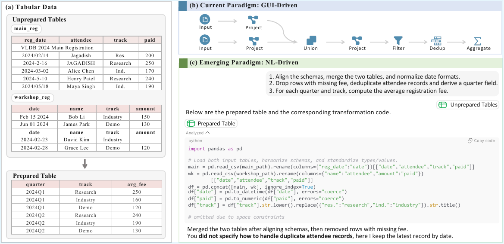

<p align="center">
  
</p>

<h1 align="center">PrepBench</h1>

<p align="center">
  <strong>How far are we from natural-language-driven data preparation?</strong>
</p>

<p align="center">
  <a href="https://arxiv.org/abs/2605.08687"></a>
  <a href="https://github.com/TsinghuaDatabaseGroup/prepbench/actions/workflows/ci.yml"></a>
  
  <a href="LICENSE"></a>
</p>

<p align="center">
  <a href="https://arxiv.org/abs/2605.08687">Paper</a> |
  <a href="docs/DATASET.md">Dataset</a> |
  <a href="docs/EVALUATION.md">Evaluation</a> |
  <a href="docs/USER_SIMULATOR.md">User Simulator</a> |
  <a href="docs/RESULTS.md">Results</a> |
  <a href="CITATION.cff">Citation</a>
</p>

PrepBench is a benchmark for evaluating agents that prepare raw tables from
natural-language instructions. Each case gives an agent a task instruction and
one or more CSV inputs; the agent must produce prepared output tables that pass
executable table-level evaluation.

PrepBench focuses on three public evaluation tracks: solving from the original
request, solving with clarification through a local user simulator, and solving
from the clarified request.

## At a Glance

| Item | Value |
| --- | --- |
| Release version | v0.1.0 |
| Cases | 306 |
| Input tables | 829 |
| Public tracks | `interactive`, `direct`, `oracle` |
| Primary input | `query.md` + `inputs/*.csv` |
| Candidate output | `solution/cand/output_*.csv` |
| Ground truth | `src/evaluate/gt/case_xxx/` |
| Optional interaction | `simulator.LocalUserSimulatorAPI` |

## Leaderboard

Coming soon. The public evaluator is ready for reproducible submissions; report
the track, method name, number of evaluated cases, table accuracy from
`acc.txt`, and disambiguation metrics when the `interactive` track uses
clarification.

## Task Formulation

For each case, an agent receives a natural-language instruction and one or more
raw CSV tables. It must produce the prepared output CSVs expected by the task.

```text
query.md + inputs/*.csv  ->  solution/cand/output_*.csv
```

The evaluator compares candidate outputs with per-case ground truth tables.
Interactive agents may ask clarification questions through the local user
simulator before producing outputs.



## Evaluation Tracks

PrepBench keeps the public evaluation surface small. Use one of three tracks:

| Track | Agent input | Interaction | Purpose |
| --- | --- | --- | --- |
| `interactive` | `query.md` + `inputs/*.csv` | May call `LocalUserSimulatorAPI` | Full ambiguous-task setting with clarification |
| `direct` | `query.md` + `inputs/*.csv` | No simulator | Tests whether the agent can solve from the original instruction alone |
| `oracle` | `query_full.md` + `inputs/*.csv` | No simulator | Tests table preparation under the clarified instruction |

All tracks use the same candidate-output contract:

```text
@output/<method>/<track>/case_xxx/solution/cand/output_*.csv
```

## Install

```bash
git clone https://github.com/TsinghuaDatabaseGroup/prepbench.git
cd prepbench
python3 -m venv .venv
source .venv/bin/activate
python -m pip install -r requirements.txt
```

## Dataset

Each case has this shape:

```text
data/case_001/
  query.md
  query_full.md
  amb_kb.json
  inputs/
    input_01.csv
```

Asset visibility:

| Asset | Visible to agents? | Purpose |
| --- | --- | --- |
| `query.md` | Yes | Original task instruction |
| `inputs/*.csv` | Yes | Raw input tables |
| `query_full.md` | Only in `oracle` track | Clarified task instruction |
| `amb_kb.json` | No | Simulator and disambiguation metadata |
| `src/evaluate/gt/` | No | Ground-truth outputs and comparison config |
| private reference solutions | No | Simulator-side evidence only |

Validate the local dataset:

```bash
python scripts/validate_dataset.py
```

Expected summary:

```text
cases=306 input_tables=829 gt_cases=306 errors=0
```

More details: [docs/DATASET.md](docs/DATASET.md).

## Evaluate an Agent

Write candidate outputs under a results root:

```text
@output/my_agent/interactive/
  case_001/
    solution/
      cand/
        output_01.csv
```

Run:

```bash
PYTHONPATH=src python -m evaluate.batch --results-root @output/my_agent/interactive
```

The evaluator writes:

```text
@output/my_agent/interactive/evaluation_summary.csv
@output/my_agent/interactive/acc.txt
```

More details: [docs/EVALUATION.md](docs/EVALUATION.md).

## Use the Local User Simulator

Set simulator credentials in `.env` or the process environment. Replace the
model value with an OpenAI-compatible model available from your provider:

```bash
PREPBENCH_SIMULATOR_MODEL=your-model-name
OPENROUTER_API_KEY=your_openrouter_api_key
```

Provide private reference solutions locally:

```bash
export PREPBENCH_SOLUTIONS_ROOT=/absolute/path/to/private_solutions
```

Then call the local API:

```python
from simulator import LocalUserSimulatorAPI

api = LocalUserSimulatorAPI(max_rounds=3, question_ratio=2.5)
session = api.start_session(case_id="case_001", run_id="demo")
response = api.ask(
    session_id=session["session_id"],
    questions=["Should the monthly date be the first day of each month?"],
    round=1,
)
print(response["answers"])
```

More details: [docs/USER_SIMULATOR.md](docs/USER_SIMULATOR.md) and
[docs/contracts/USER_SIMULATOR_LOCAL.md](docs/contracts/USER_SIMULATOR_LOCAL.md).

## Results

Paper result figures and benchmark analysis are collected in
[docs/RESULTS.md](docs/RESULTS.md). The public repository exposes the
table-output evaluator and disambiguation metrics for the tracks above; workflow
translation results are documented as paper analysis unless a corresponding
public evaluator is released.

## Reporting Results

Report the track, model or agent name, table accuracy from `acc.txt`, and
whether disambiguation metrics were used. If only a subset of cases was run,
report the case range explicitly.

## Minimal Example

`examples/user_simulator_demo.py` shows the local simulator API. For submission
layout only, see `examples/submission_layout/README.md`.

## FAQ

**Which track should I use?** Use `interactive` for the full benchmark,
`direct` for no-clarification agents, and `oracle` when you want to isolate
table preparation under clarified instructions.

**Why is my case marked `NOT_FOUND`?** The evaluator expects candidate CSVs under
`case_xxx/solution/cand/`.

**Why does the simulator fail before answering?** Set a simulator API key and
make sure `PREPBENCH_SOLUTIONS_ROOT` points to private reference solutions.

## Private Assets

Reference solutions are used only by benchmark-side simulation. They are not
part of the public repository and are ignored by Git.

Supported local layouts:

```text
case001/solution.py
case_001/solution.py
case001.py
case_001.py
```

Default local mount point:

```text
src/simulator/assets/solutions/
```

## Citation

If you use PrepBench in research, cite the paper and this repository. Citation
metadata is available in [CITATION.cff](CITATION.cff).
