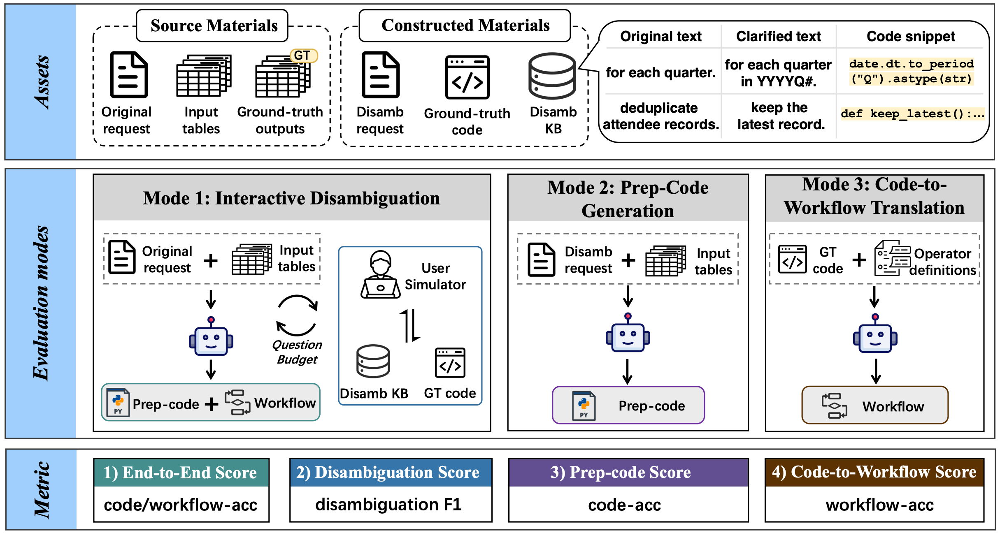

<p align="center">
  
</p>

<h1 align="center">PrepBench</h1>

<p align="center">
  <strong>How far are we from natural-language-driven data preparation?</strong>
</p>

<p align="center">
  <a href="https://www.vldb.org/2026/"></a>
  <a href="https://arxiv.org/abs/2605.08687"></a>
  <a href="https://www.alphaxiv.org/abs/2605.08687"></a>
  <a href="https://github.com/TsinghuaDatabaseGroup/prepbench/actions/workflows/ci.yml"></a>
  
  <a href="LICENSE"></a>
</p>

<p align="center">
  <a href="https://arxiv.org/abs/2605.08687">Paper</a> |
  <a href="docs/DATASET.md">Dataset</a> |
  <a href="docs/EVALUATION.md">Evaluation</a> |
  <a href="docs/USER_SIMULATOR.md">User Simulator</a> |
  <a href="docs/WORKFLOW_EXECUTION.md">Workflow Execution</a> |
  <a href="CITATION.cff">Citation</a>
</p>

PrepBench is the benchmark and open-source implementation accompanying our
[VLDB 2026](https://www.vldb.org/2026/) paper. It evaluates whether an agent can
prepare correct output tables from a natural-language request and CSV inputs.
The benchmark gives each case as a workspace. Your agent runs in that workspace
and writes `result/output_*.csv`; PrepBench evaluates those files.

## At a Glance

| Item | Value |
| --- | --- |
| Paper | VLDB 2026 (PVLDB Volume 19) |
| Release version | v0.1.0 |
| Cases | 306 |
| Input tables | 829 |
| Public modes | `clarified`, `interactive`, `workflow` |
| Case workspace | `@runs/<agent>/<mode>/<case_id>/` |
| Candidate output | `result/output_*.csv` |
| Ground truth | `src/evaluate/gt/case_xxx/` |
| Optional tools | user simulator, workflow executor |

## Public Modes

PrepBench exposes exactly three public modes, ordered from simplest to most
end-to-end.

| Mode | Workspace input | Extra tool | Goal |
| --- | --- | --- | --- |
| `clarified` | clarified `query.md` + `inputs/` | none | Generate and run code to produce `result/output_*.csv` |
| `interactive` | original `query.md` + `inputs/` | user simulator | Clarify with the simulator, then generate and run code to produce `result/output_*.csv` |
| `workflow` | original `query.md` + `inputs/` + `workflow_prompt.md` | user simulator + workflow executor | Clarify with the simulator, generate code, convert it to a workflow, then run the workflow to produce `result/output_*.csv` |

All modes are evaluated the same way: PrepBench reads
`@runs/<agent>/<mode>/<case_id>/result/output_*.csv` and compares those files
with the expected output tables.

## Install

```bash
git clone https://github.com/TsinghuaDatabaseGroup/prepbench.git
cd prepbench
python3 -m venv .venv
source .venv/bin/activate
python -m pip install -r requirements.txt
python -m pip install -e .
```

Commands below assume this virtualenv is activated; use `python` from the
activated environment.

PrepBench is intended to run from a source checkout because the dataset,
simulator assets, workflow prompt, and evaluator ground truth live in the repo.
The editable install makes the simulator and workflow executor importable when
your agent runs from `@runs/...`; alternatively set
`PYTHONPATH=/path/to/prepbench/src`.

> **Note:** The editable install registers a package named `evaluate`. If you
> have HuggingFace `evaluate` installed in the same environment, the two will
> conflict. Use a dedicated virtualenv for PrepBench.

## Basic Flow

```text
prepare workspace -> run your agent -> write result/output_*.csv -> evaluate
```

Local runs live under a run root written `@runs/<agent>/<mode>/`. The `@runs/`
prefix is just the naming convention for this directory, and it is git-ignored so
your runs are never committed.

PrepBench is an honor-system benchmark: the repository ships evaluator and
simulator assets, but your agent should read only the files exposed in its
prepared workspace.

## Quickstart

Prepare one case workspace, run your agent in it, then evaluate.

**1. Prepare a workspace**

```bash
python scripts/prepare_run.py \
  --mode clarified \
  --case case_001 \
  --run-root @runs/my_agent/clarified
```

```text
@runs/my_agent/clarified/case_001/
  query.md
  inputs/
  result/
```

`interactive` workspaces also contain `clarification_guide.md`; `workflow`
workspaces add `workflow_prompt.md`. Workspace files are symlinks where
possible, so setup is cheap.

**2. Run your agent**

Point your agent at the workspace path (not copied file contents). It reads
`query.md` and `inputs/`, may write code or other working files, and must write
final tables to `result/output_*.csv`. See [Agent Integration](#agent-integration)
for what each mode exposes.

**3. Evaluate**

```bash
python scripts/evaluate_submission.py \
  --mode clarified \
  --run-root @runs/my_agent/clarified \
  --case case_001
```

Results land in `evaluation/summary.json` and `evaluation/summary.csv` under the
run root. See [docs/EVALUATION.md](docs/EVALUATION.md) for the scoring rules,
summary fields, and full-run behavior.

For quick smoke tests before a full run, use `case_001`, `case_002`, and
`case_003`. They are small enough to debug quickly and work across all three
public modes.

## Run the Full Benchmark

Prepare every GT case with `--all`, then evaluate the run root without `--case`:

```bash
python scripts/prepare_run.py --mode clarified --all --run-root @runs/my_agent/clarified
python scripts/evaluate_submission.py --mode clarified --run-root @runs/my_agent/clarified
```

`--all` uses the evaluator GT case set and requires matching `data/case_xxx`
directories. A full run exits with code 0 only when every case passes; missing
folders or result tables are reported as `NOT_FOUND`.

## Agent Integration

You run the agent; PrepBench only prepares workspaces and scores result tables.
Point your agent at the prepared workspace (not copied file contents), let it read
only the files exposed there, and have it write final tables under
`result/output_*.csv`. Intermediate code, notebooks, logs, or workflow JSON may
stay in the workspace but are not scored. See the [Public Modes](#public-modes)
table for what each mode exposes.

In `interactive` and `workflow` mode, the agent calls the local user simulator to
clarify the request before writing results:

```python
from simulator import LocalUserSimulatorAPI

api = LocalUserSimulatorAPI()
session = api.start_session(case_id="case_001", run_id="my_agent")
reply = api.ask(
    session_id=session["session_id"],
    questions=["Should the monthly date be the first day of each month?"],
)
```

Keep the simulator backend fixed for comparable runs. A practical default is
`deepseek-v4-flash` in non-thinking mode with `PREPBENCH_SIMULATOR_TEMPERATURE=0`,
but other OpenAI-compatible providers can be used.
Store API keys in your shell environment or a local `.env` file. Do not commit
`.env` or API keys.
See [docs/USER_SIMULATOR.md](docs/USER_SIMULATOR.md) for provider settings and the
question budget.

In `workflow` mode, the agent additionally reads `workflow_prompt.md`, converts
its prep logic into a workflow JSON file, and runs the workflow executor (reads
`./inputs`, writes `./result`) to produce the result tables. See
[docs/WORKFLOW_EXECUTION.md](docs/WORKFLOW_EXECUTION.md).

## Minimal Smoke Tests

Validate the dataset:

```bash
python scripts/validate_dataset.py
```

Expected summary:

```text
cases=306 input_tables=829 gt_cases=306 solution_cases=306 errors=0
```

Run an evaluator demo that copies known-correct GT output for one case into the
public result layout:

```bash
python examples/evaluate_demo.py
```

Check the user simulator backend before running `interactive` or `workflow`:

```bash
python scripts/check_simulator.py --case case_001
```

Run the repository checks:

```bash
PYTHON=python3 make check
```

## Paper Context

The paper also describes PrepBench assets, historical evaluation modes, and
metrics. This figure is paper context; the public run contract above still uses
prepared workspaces and evaluates only `result/output_*.csv`.

<p align="center">
  
</p>

## More Documentation

- Dataset and allowed-input policy: [docs/DATASET.md](docs/DATASET.md)
- Evaluation details: [docs/EVALUATION.md](docs/EVALUATION.md)
- User simulator API: [docs/USER_SIMULATOR.md](docs/USER_SIMULATOR.md)
- Workflow executor: [docs/WORKFLOW_EXECUTION.md](docs/WORKFLOW_EXECUTION.md)

## FAQ

**Which mode should I start with?** Use `clarified` first to check basic table
preparation, then `interactive`, then `workflow` if you want to evaluate an
agent's workflow-generation path.

**What does the evaluator score?** Only final result tables under
`result/output_*.csv`.
