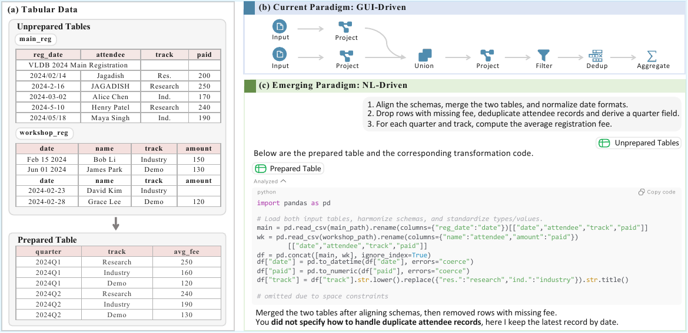

<p align="center">
  
</p>

<h1 align="center">PrepBench</h1>

<p align="center">
  <strong>How far are we from natural-language-driven data preparation?</strong>
</p>

<p align="center">
  <a href="https://arxiv.org/abs/2605.08687"></a>
  <a href="https://github.com/TsinghuaDatabaseGroup/prepbench/actions/workflows/ci.yml"></a>
  
  <a href="LICENSE"></a>
</p>

<p align="center">
  <a href="https://arxiv.org/abs/2605.08687">Paper</a> |
  <a href="docs/DATASET.md">Dataset</a> |
  <a href="docs/EVALUATION.md">Evaluation</a> |
  <a href="docs/USER_SIMULATOR.md">User Simulator</a> |
  <a href="docs/RESULTS.md">Results</a> |
  <a href="CITATION.cff">Citation</a>
</p>

PrepBench is a benchmark for evaluating agents that prepare raw tables from
natural-language instructions. Each case gives an agent a task instruction and
one or more CSV inputs; the agent must produce prepared output tables that pass
executable table-level evaluation.

PrepBench focuses on three public evaluation tracks: solving from the original
request, solving with clarification through a local user simulator, and solving
from the clarified request.

## At a Glance

| Item | Value |
| --- | --- |
| Release version | v0.1.0 |
| Cases | 306 |
| Input tables | 829 |
| Public tracks | `interactive`, `direct`, `oracle` |
| Primary input | `query.md` + `inputs/*.csv` |
| Candidate output | `solution/cand/output_*.csv` |
| Ground truth | `src/evaluate/gt/case_xxx/` |
| Optional interaction | `simulator.LocalUserSimulatorAPI` |

## Leaderboard

A public leaderboard will be announced separately. Official submissions should
cover all 306 cases in one track. Submit candidate outputs in the documented
layout; the evaluator produces the final table-accuracy score in `acc.txt`.
Subset runs are useful for debugging, but they are not official leaderboard
scores.

## Task Formulation

For each case, an agent receives a natural-language instruction and one or more
raw CSV tables. It must produce the prepared output CSVs expected by the task.

```text
query.md + inputs/*.csv  ->  solution/cand/output_*.csv
```

The evaluator compares candidate outputs with per-case ground truth tables.
Interactive agents may ask clarification questions through the local user
simulator before producing outputs.



## Evaluation Tracks

PrepBench keeps the public evaluation surface small. Use one of three tracks:

| Track | Agent input | Interaction | Purpose |
| --- | --- | --- | --- |
| `interactive` | `query.md` + `inputs/*.csv` | May call `LocalUserSimulatorAPI` | Full ambiguous-task setting with clarification |
| `direct` | `query.md` + `inputs/*.csv` | No simulator | Tests whether the agent can solve from the original instruction alone |
| `oracle` | `query_full.md` + `inputs/*.csv` | No simulator | Tests table preparation under the clarified instruction |

All tracks use the same candidate-output contract:

```text
@output/<method>/<track>/case_xxx/solution/cand/output_*.csv
```

## Install

```bash
git clone https://github.com/TsinghuaDatabaseGroup/prepbench.git
cd prepbench
python3 -m venv .venv
source .venv/bin/activate
python -m pip install -r requirements.txt
```

PrepBench is intended to be run from a source checkout. The evaluator, dataset,
ground truth, and reference solutions use repository-relative paths; an installed
wheel alone is not a complete benchmark bundle.

## Dataset

Each case has this shape:

```text
data/case_001/
  query.md
  query_full.md
  amb_kb.json
  inputs/
    input_01.csv
```

Model-input policy:

| Asset | Included in repo? | Allowed as model input? | Purpose |
| --- | --- | --- | --- |
| `query.md` | Yes | `interactive`, `direct` | Original task instruction |
| `inputs/*.csv` | Yes | All tracks | Raw input tables |
| `query_full.md` | Yes | `oracle` only | Clarified task instruction |
| `amb_kb.json` | Yes | No | Simulator and ambiguity metadata |
| `src/evaluate/gt/` | Yes | No | Ground-truth outputs and comparison config |
| `reference/solutions/` | Yes | No | Reference implementations for reproducibility and simulator evidence |

Validate the local dataset:

```bash
python scripts/validate_dataset.py
```

Expected summary:

```text
cases=306 input_tables=829 gt_cases=306 solution_cases=306 errors=0
```

More details: [docs/DATASET.md](docs/DATASET.md).

## Evaluate an Agent

Write candidate outputs under a results root:

```text
@output/my_agent/interactive/
  case_001/
    solution/
      cand/
        output_01.csv
```

Run:

```bash
PYTHONPATH=src python -m evaluate.batch --results-root @output/my_agent/interactive
```

The evaluator writes:

```text
@output/my_agent/interactive/evaluation_summary.csv
@output/my_agent/interactive/acc.txt
```

More details: [docs/EVALUATION.md](docs/EVALUATION.md).

## Use the Local User Simulator

Set simulator credentials in `.env` or the process environment. Replace the
model value with an OpenAI-compatible model available from your provider:

```bash
PREPBENCH_SIMULATOR_MODEL=your-model-name
PREPBENCH_SIMULATOR_API_KEY=your_api_key
# Also supported: OPENROUTER_API_KEY or OPENAI_API_KEY
```

The local simulator uses the public reference solutions in `reference/solutions/`
by default. You can override that path with `PREPBENCH_SOLUTIONS_ROOT` when
testing alternate benchmark-side solutions.

Then call the local API:

```python
from simulator import LocalUserSimulatorAPI

api = LocalUserSimulatorAPI(max_rounds=3, question_ratio=2.5)
session = api.start_session(case_id="case_001", run_id="demo")
response = api.ask(
    session_id=session["session_id"],
    questions=["Should the monthly date be the first day of each month?"],
    round=1,
)
print(response["answers"])
```

More details: [docs/USER_SIMULATOR.md](docs/USER_SIMULATOR.md) and
[docs/contracts/USER_SIMULATOR_LOCAL.md](docs/contracts/USER_SIMULATOR_LOCAL.md).

## Results

Paper result figures and benchmark analysis are collected in
[docs/RESULTS.md](docs/RESULTS.md) as paper context. The open-source benchmark
surface for leaderboard submissions is the table-output evaluator for the tracks
above.

## Reporting Results

For leaderboard submission, provide candidate outputs for all 306 cases in one
track. The published score is the table accuracy produced by the evaluator.
For local debugging, subset runs are allowed, but their `acc.txt` denominator
still covers all GT cases because missing cases are marked `NOT_FOUND`.

## Minimal Example

`examples/user_simulator_demo.py` shows the local simulator API. For submission
layout only, see `examples/submission_layout/README.md`.

## FAQ

**Which track should I use?** Use `interactive` for the full benchmark,
`direct` for no-clarification agents, and `oracle` when you want to isolate
table preparation under clarified instructions.

**Why is my case marked `NOT_FOUND`?** The evaluator expects candidate CSVs under
`case_xxx/solution/cand/`.

**Why does the simulator fail before answering?** Set a simulator API key. If
you changed the default reference-solution path, make sure
`PREPBENCH_SOLUTIONS_ROOT` points to a compatible solutions directory.

## Reference Solutions

Reference solutions are included for reproducibility, validator maintenance, and
benchmark-side user simulation. They are answer artifacts: do not use them as
model input or submission assistance when evaluating an agent.

Run the supported verifier instead of executing a `solution.py` file directly:

```bash
make verify-reference-outputs
```

Supported local layouts:

```text
case001/solution.py
case_001/solution.py
case001.py
case_001.py
```

Default local mount point:

```text
reference/solutions/
```

## Citation

If you use PrepBench in research, cite the paper and this repository. Citation
metadata is available in [CITATION.cff](CITATION.cff). Third-party source
attribution is summarized in [NOTICE.md](NOTICE.md).
