# Experimental Results

This page collects the figures used in the PrepBench paper. The public
repository exposes table-output evaluation and disambiguation metrics for the
`interactive`, `direct`, and `oracle` tracks described in
[EVALUATION.md](EVALUATION.md). Figures about workflow translation are paper
analysis unless a corresponding public workflow evaluator is released.

## Dataset Statistics

PrepBench `v0.1.0` contains 306 cases and 829 input tables in the public release.

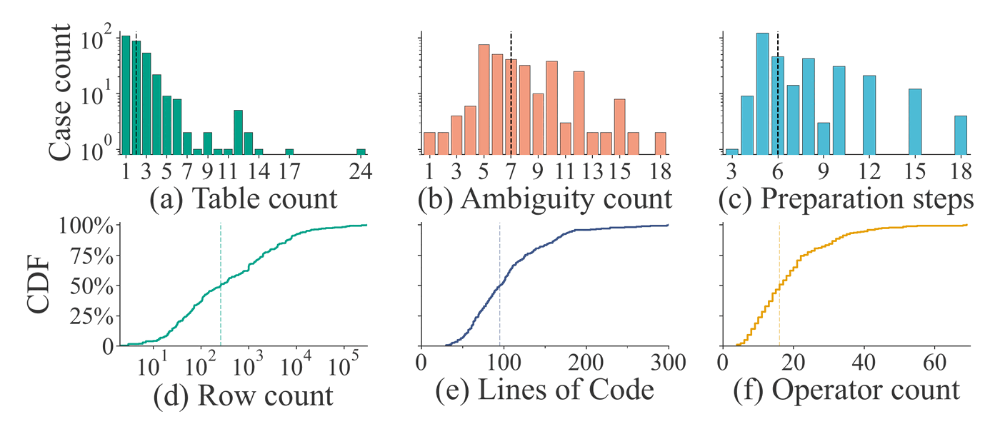

## Ambiguity

The benchmark categorizes ambiguity by where missing information appears while
translating a natural-language request into an executable preparation program.

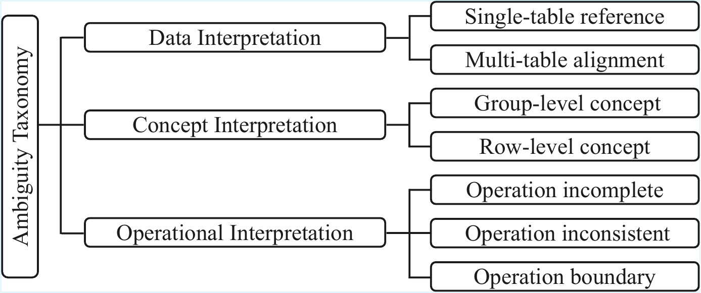

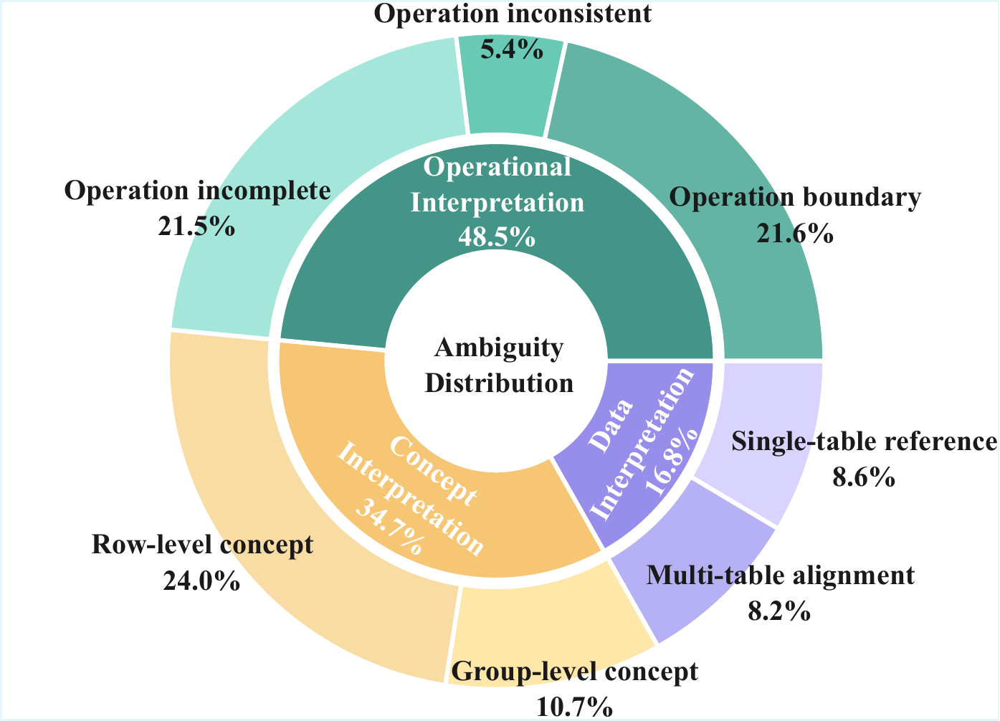

Clarified requests substantially improve table-preparation accuracy across
agents.

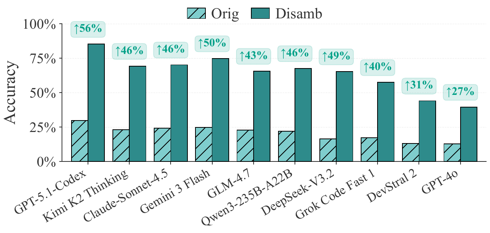

## Interaction

Interaction helps agents recover from ambiguous requests, but gains depend on
the model and on question quality.

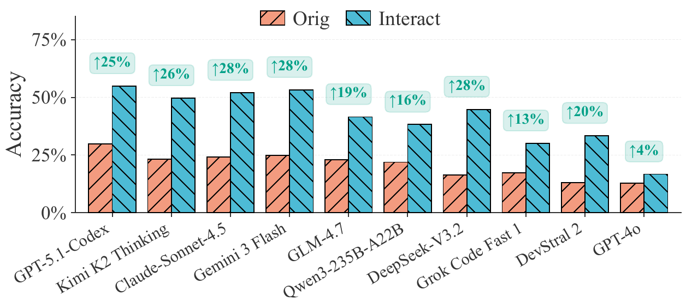

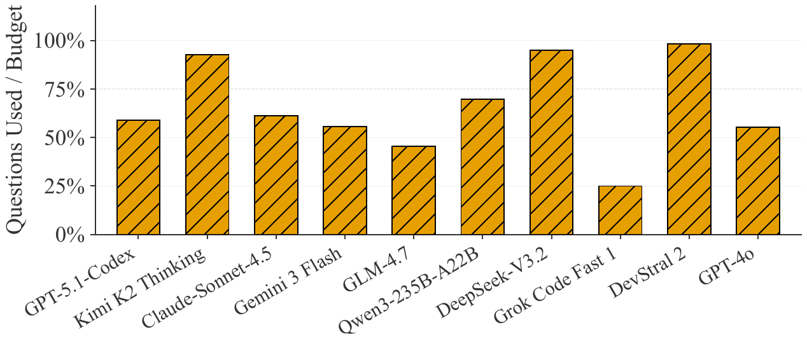

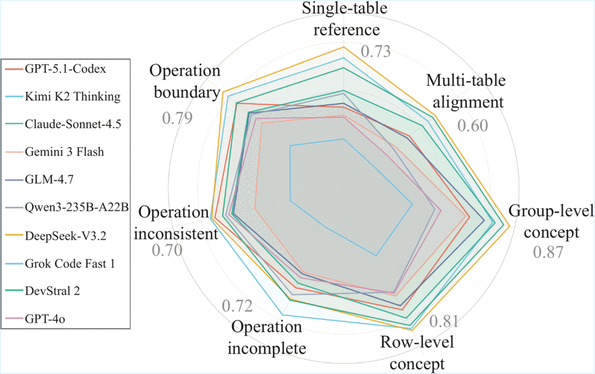

## Profiling

Data profiling has uneven effects across agents and irregularity types.

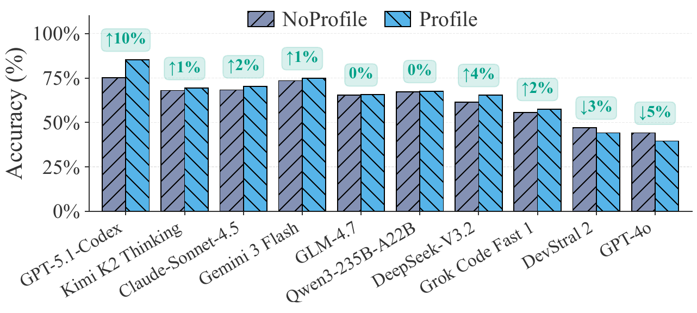

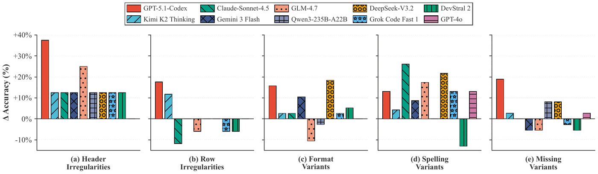

## Workflow Translation

These figures analyze the paper's workflow-translation setting. They are
included here for completeness, but the current public release centers on
table-output evaluation.

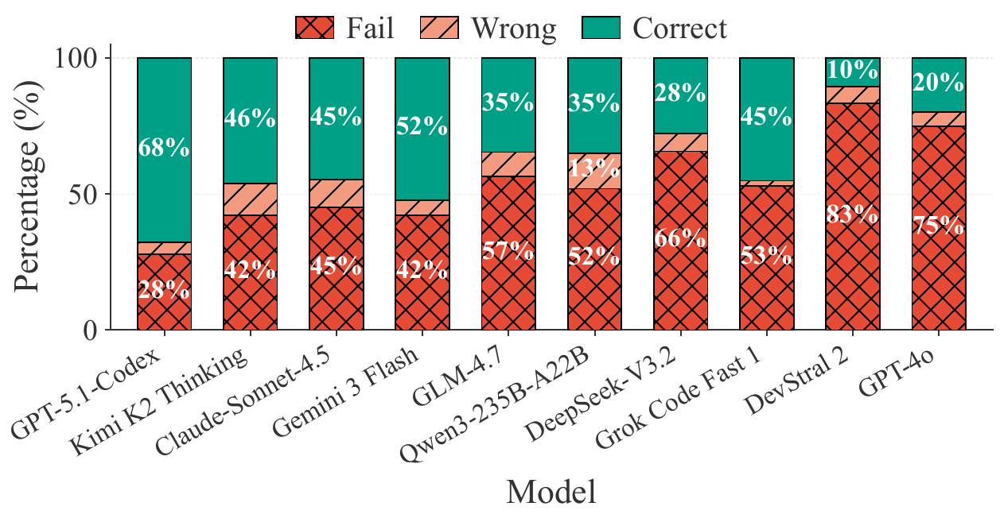

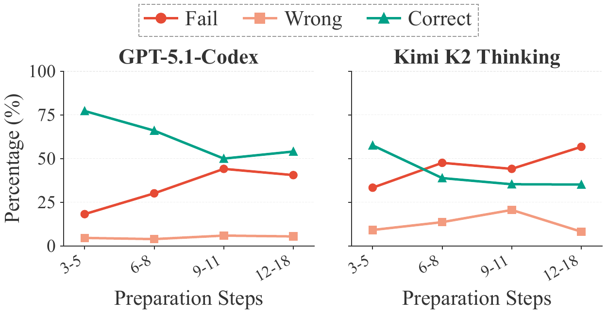
