# Paper Results

This page collects figures from the PrepBench paper. They are included as
context for the benchmark design, not as a required reproduction workflow for
leaderboard users.

For public evaluation, use the workspace contract and table-output evaluator
described in [EVALUATION.md](EVALUATION.md). The public modes are `clarified`,
`interactive`, and `workflow`.

## Dataset Statistics

PrepBench `v0.1.0` contains 306 cases and 829 input tables in the public release.

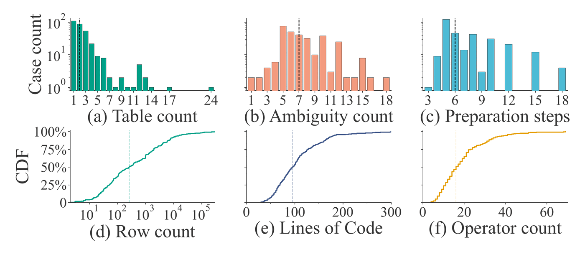

## Ambiguity

The benchmark categorizes ambiguity by where missing information appears while
translating a natural-language request into an executable preparation program.

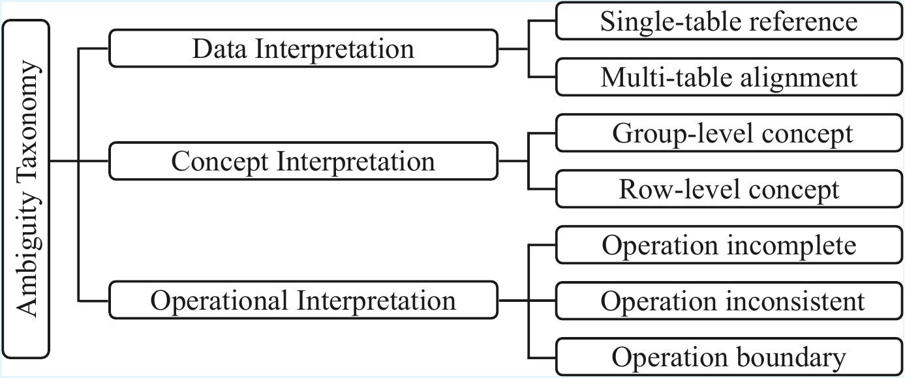

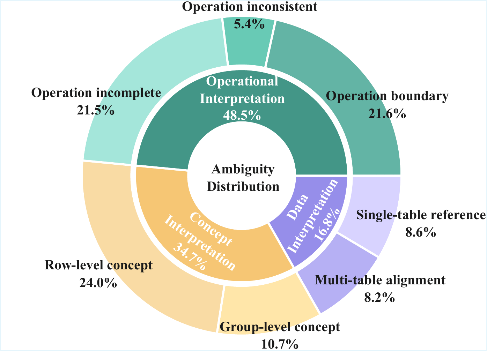

Clarified requests substantially improve table-preparation accuracy across
agents.

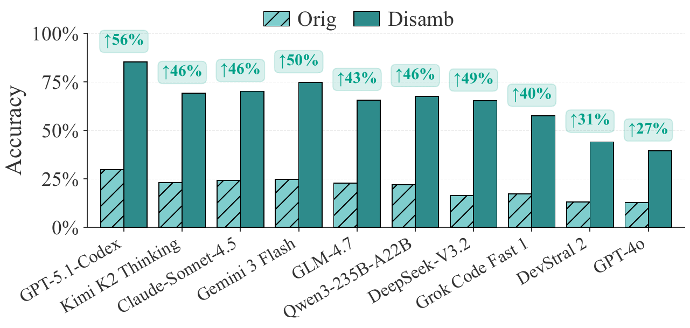

## Interaction

Interaction helps agents recover from ambiguous requests, but gains depend on
the model and on question quality.

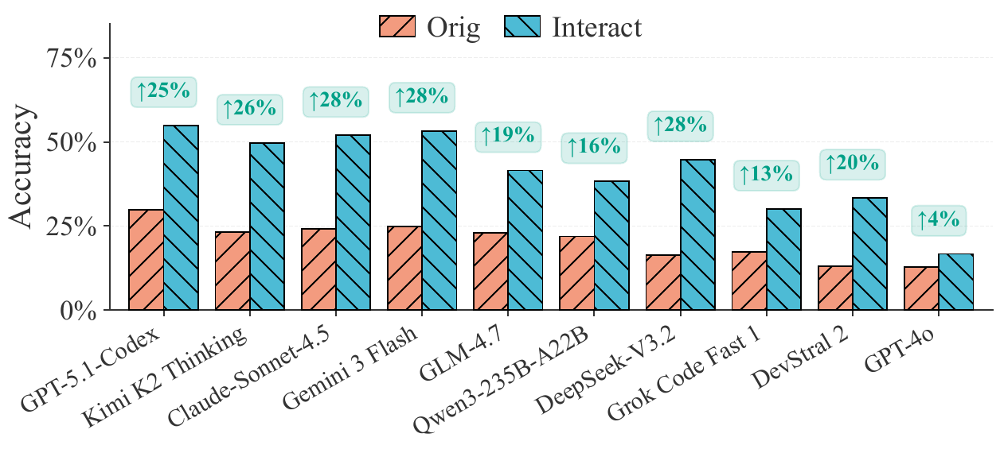

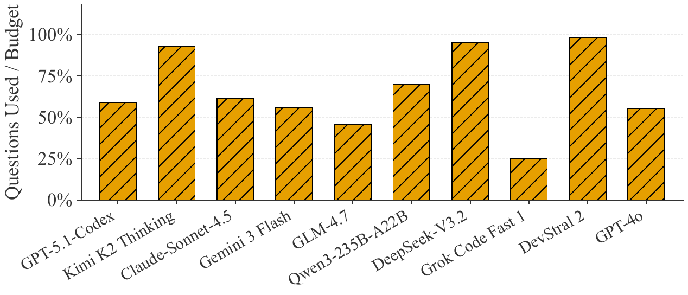

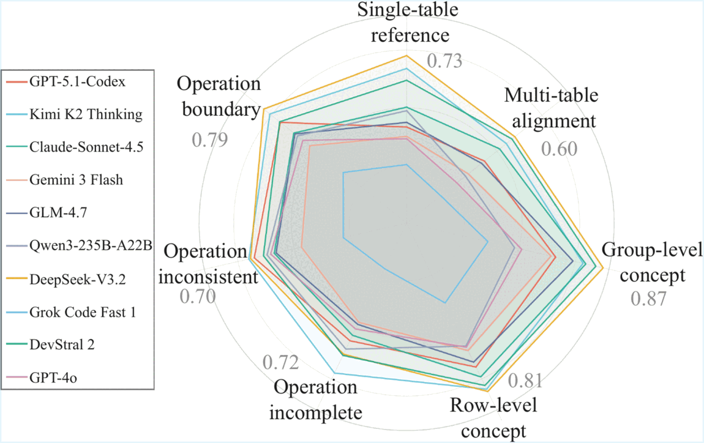

## Profiling

Data profiling has uneven effects across agents and irregularity types.

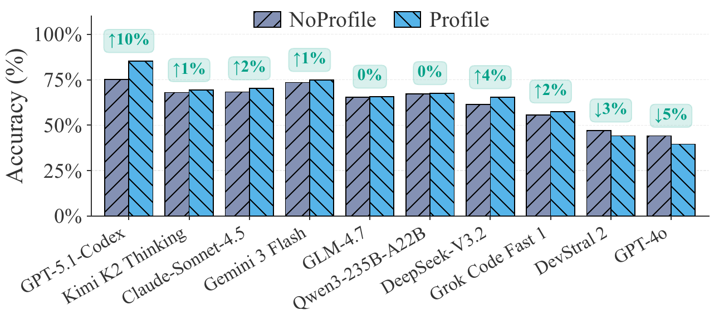

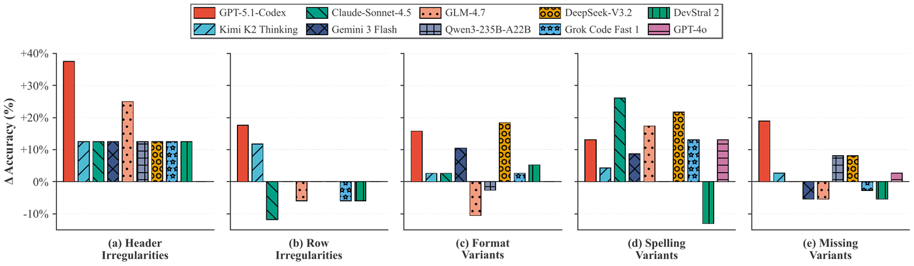

## Workflow Translation

These figures analyze the paper's historical workflow-translation setting. They
are included here for paper context. The current public workflow mode uses the
workspace contract and evaluates only final `result/output_*.csv` tables.

For the restored experimental workflow executor, see
[WORKFLOW_EXECUTION.md](WORKFLOW_EXECUTION.md).

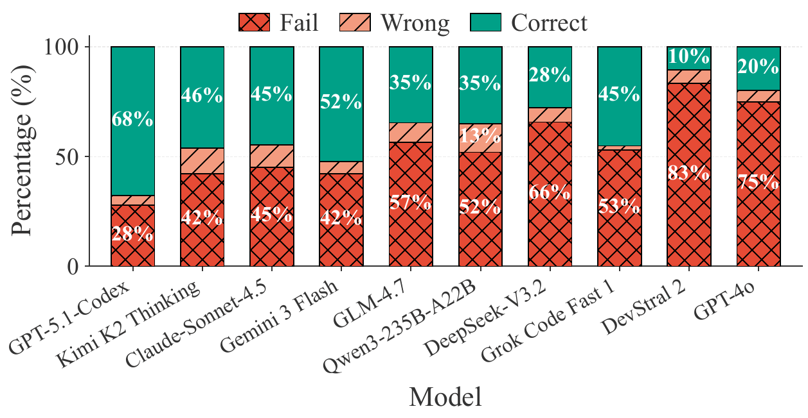

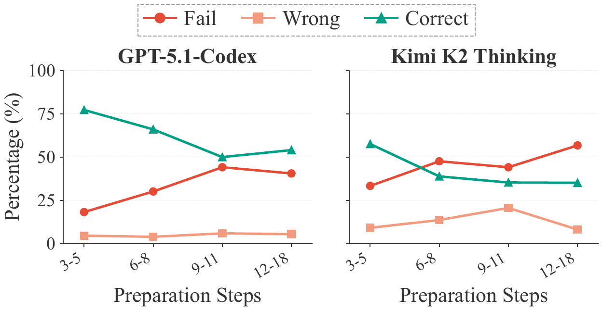
